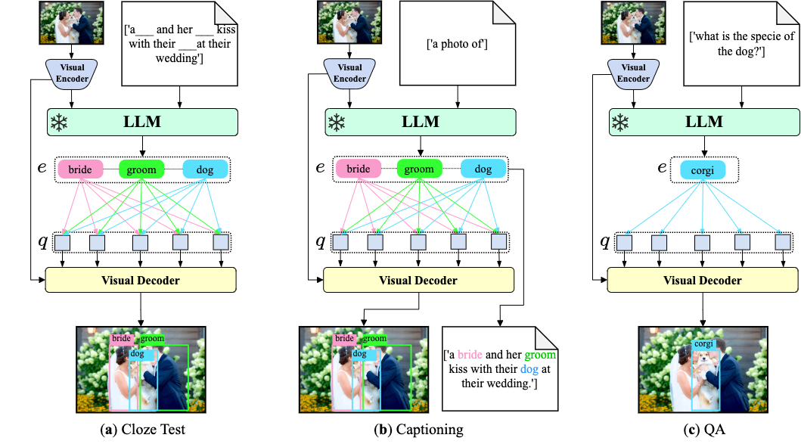
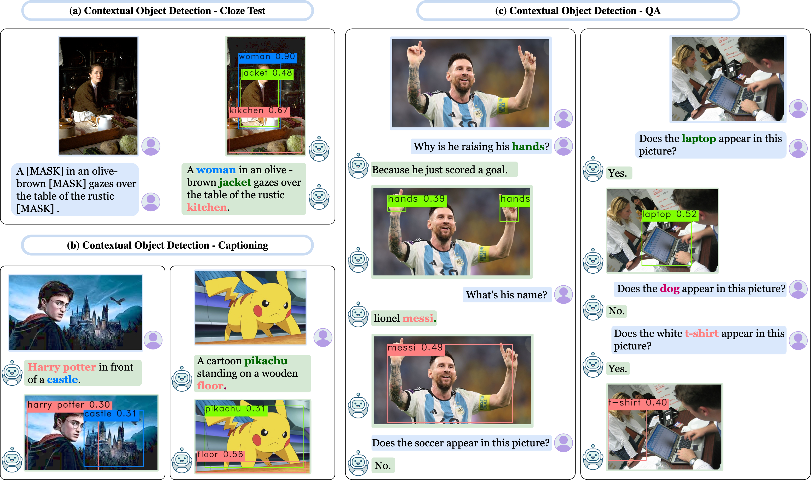
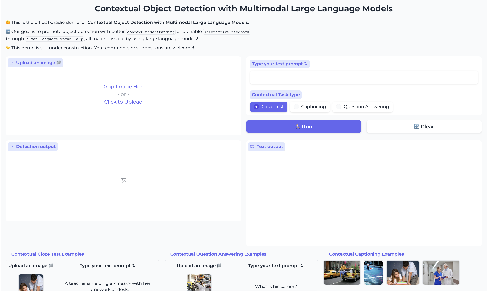

<h2 align="center" width="100%">
Contextual Object Detection with Multimodal Large Language Models
</h2>
<div>
<div align="center">
    <a href='https://yuhangzang.github.io/' target='_blank'>Yuhang Zang</a>&emsp;
    <a href='https://weivision.github.io/' target='_blank'>Wei Li</a>&emsp;
    <a href='https://www.linkedin.com/in/han-jun-581849193/' target='_blank'>Jun Han</a>&emsp;
    <a href='https://kaiyangzhou.github.io/' target='_blank'>Kaiyang Zhou</a>&emsp;
    </br>
    <a href='https://www.mmlab-ntu.com/person/ccloy/index.html' target='_blank'>Chen Change Loy</a>&emsp;
</div>
<div>
<div align="center">
    S-Lab, Nanyang Technological University
</div>

<p align="center">
  <a href="https://arxiv.org/abs/xxxx.xxxxx" target='_blank'>
    
  </a>
  <a href="https://www.mmlab-ntu.com/project/contextdet/index.html" target='_blank'>
    
  </a>
  <a href="https://huggingface.co/spaces/yuhangzang/ContextDet-Demo">
    
  </a>
</p>

Currently, we only offer the <a href="https://huggingface.co/spaces/yuhangzang/ContextDet-Demo">Hugging Face demo code</a>. The training data and scripts will be made available once this paper is accepted.

## 🌟 Contextual Object Detection
Recent Multimodal Large Language Models (MLLMs) are remarkable in vision-language tasks, such as image captioning and question answering, but lack the essential perception ability, <i>i.e</i>., object detection. In this work, we address this limitation by introducing a novel research problem of <strong>contextual object detection</strong>--understanding visible objects within different human-AI interactive contexts. Three representative scenarios are investigated, including the language cloze test, visual captioning, and question answering.

<div style="text-align:center">

</div>
    
### Comparison with Related Works
| Task | Language Input | Output(s) | Remark |
|---|---|---|---|
| Object Detection | ✗ | box, class label | pre-defined class labels |
| Open-Vocabulary Object Detection | (optional) class names for CLIP | box, class label	| pre-defined class labels |
| Referring Expression Comprehension | complete referring expression | box that expression refers to | / |
| <b>Contextual Cloze Test</b> (ours) | <b>incomplete</b> expression, object names are masked	 | {box, <b>name</b>} to complete the mask | <b>name</b> could be most valid English word |
| Image Captioning | ✗ | language caption | / |
| <b>Contextual Captioning</b> (ours) | ✗ | language caption, <b>box</b> | / |
| Visual Question Answering | language question | language answer | / |
| <b>Contextual QA</b> (ours) | language question | language question, <b>box</b> | / |

  
## 😎 Method

We present ContextDET, a novel <i>generate-then-detect</i> framework, specialized for contextual object detection. ContextDET is end-to-end and consists of three key architectural components:
1) a visual encoder that extracts high-level image representations and computes visual tokens, 
2) a pre-trained LLM that decodes multimodal contextual tokens with a task-related multimodal prefix, and
3) a visual decoder that predicts matching scores and bounding boxes for conditional queries linked to contextual object words.

The new <strong>generate-then-detect</strong> framework enables us to detect object words within human vocabulary.

<div style="text-align:center">

</div>
  
## 🥰 Qualitative Examples
<div style="text-align:center">

</div>

## 💻 Try Demo
🤗 You can try our demo on <a href="https://huggingface.co/spaces/yuhangzang/ContextDet-Demo">HuggingFace spaces</a>. To avoid waiting in the queue and speed up your inference, consider <a href="https://huggingface.co/spaces/yuhangzang/ContextDet-Demo?duplicate=true">duplicating the space</a> and use GPU resources.

🤗 If you want to try the demo on your own computer with GPU, follow these steps
1. Install the required python packages:
```bash
pip install -r requirements.txt
```
2. Download the checkpoint file from the following <a href="https://drive.google.com/file/d/1ko_QPvhaHpmi7ASrkaLNSakJ2MYHMqFG/view?usp=share_link">URL</a> and save it in your local directory.
3. Now, you're ready to run the demo. Execute the following command:
```bash
python app.py
```
You are expected to see the following web page:
<div style="text-align:center">

</div>

## 📝 Citation
We would be grateful if you consider citing our work if you find it useful:
```bibtex
@article{zang2023contextual,
  author = {Zang, Yuhang and Li, Wei and Han, Jun, and Zhou, Kaiyang and Loy, Chen Change},
  title = {Contextual Object Detection with Multimodal Large Language Models},
  journal = {arXiv preprint arXiv:xxxx.xxxxx},
  year = {2023}
}
```

## 📋 Liscense
This project is licensed under
<a rel="license" href="https://github.com/yuhangzang/ContextDET/blob/master/LICENSE">S-Lab License 1.0</a>.
Redistribution and use for non-commercial purposes should follow this license.

## 😃 Acknowledgement
We acknowledge the use of the following public code in this project: <sup>1</sup>[DETR](https://github.com/facebookresearch/detr),
  <sup>2</sup>[Deformable DETR](https://github.com/fundamentalvision/Deformable-DETR), <sup>3</sup>[DETA](https://github.com/jozhang97/DETA),
  <sup>4</sup>[OV DETR](https://github.com/yuhangzang/OV-DETR), <sup>5</sup>[BLIP2](https://github.com/salesforce/LAVIS/tree/main/projects/blip2).

## 📧 Contact
If you have any questions, please feel free to contact Yuhang Zang <b>(zang0012 AT ntu.edu.sg)</b>.